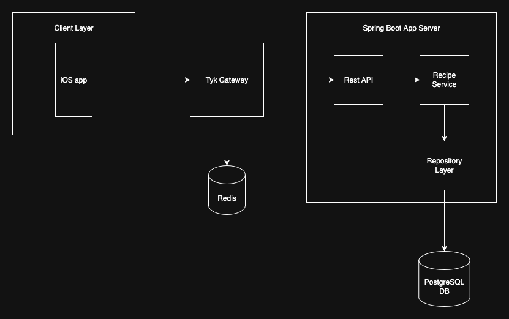
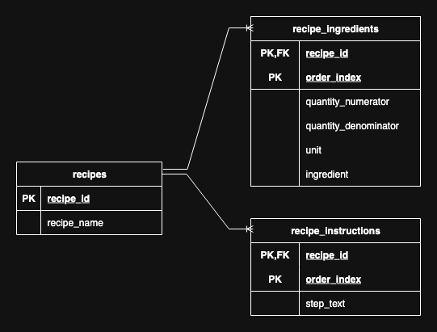

# recipe-service
A project for storing and retrieving recipes

## System Diagram

## Database Design

## Running locally

The service persists recipes to a self-hosted PostgreSQL database (no managed/serverless offering required). Schema migrations run automatically via Flyway on startup.

1. Start a local PostgreSQL instance: `docker compose up -d`
2. Run the app: `./gradlew bootRun`

Connection settings can be overridden with the `DB_HOST`, `DB_PORT`, `DB_NAME`, `DB_USERNAME`, and `DB_PASSWORD` environment variables (see `src/main/resources/application.properties`).
